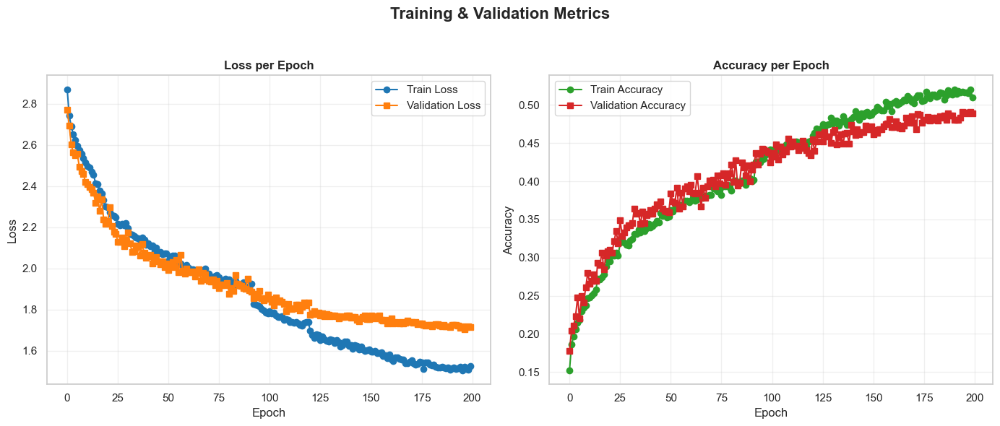
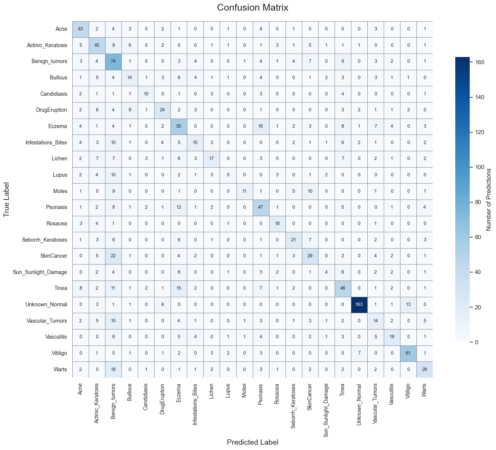
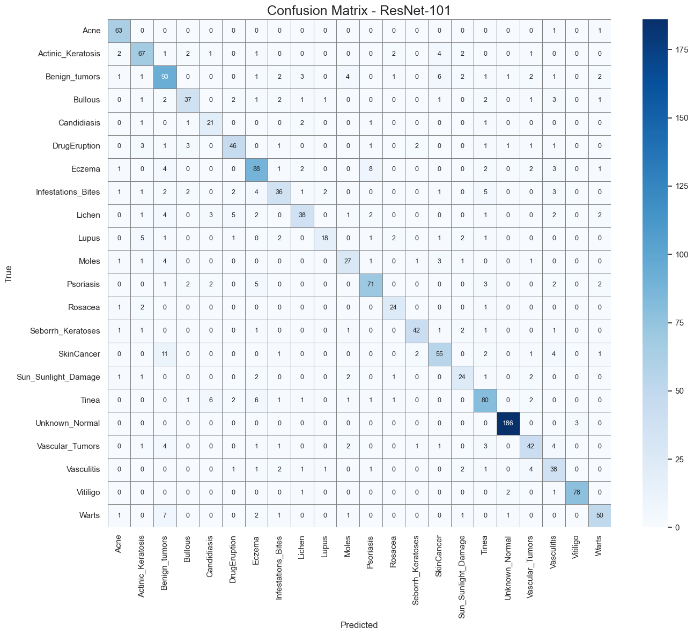
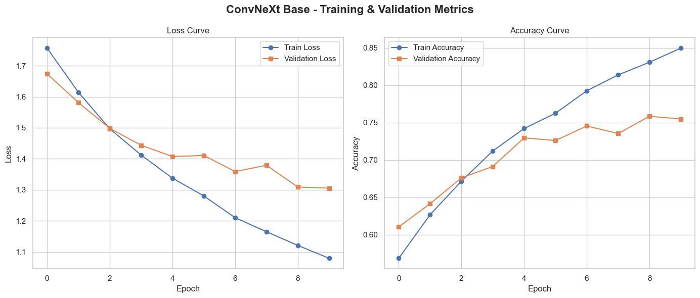

# 🩺 Skin Disease Detection
### Klasifikasi Penyakit Kulit Menggunakan Deep Learning

<p align="center">
  
  
  
  
  
</p>

<p align="center">
  <strong>Ujian Akhir Praktikum (UAP) Pembelajaran Mesin</strong><br/>
  Universitas Muhammadiyah Malang
</p>

<p align="center">
  <a href="https://github.com/rofiqsamanhudi/skin-disease-detection">
    
  </a>
  <a href="https://skin-disease-detection-sdszshzhy4kvvgmrcxynnq.streamlit.app/">
    
  </a>
</p>

---

## 👨‍💻 Biodata

| Keterangan | Detail |
| :-- | :-- |
| **Nama** | Rofiq Samanhudi |
| **NIM** | 202210370311260 |
| **Program Studi** | Informatika |
| **Semester** | 7 (Tujuh) |
| **Mata Kuliah** | Pembelajaran Mesin |
| **Dosen Pengampu** | Setio Basuki, S.T., M.T., Ph.D. |
| **Topik Penelitian** | Klasifikasi Penyakit Kulit |
| **Sumber Dataset** | Skin Disease Dataset (Kaggle) |
| **Tahun Akademik** | 2024 / 2025 |

---

## 📖 Studi Kasus & Latar Belakang

Penyakit kulit merupakan salah satu masalah kesehatan yang umum terjadi dan memiliki variasi jenis yang luas. Proses diagnosis penyakit kulit secara konvensional sangat bergantung pada pengalaman dan keahlian tenaga medis, serta dapat memerlukan waktu yang cukup lama, terutama ketika jumlah pasien tinggi atau akses ke dokter spesialis terbatas.

Seiring berkembangnya teknologi, **Computer Vision** dan **Artificial Intelligence (AI)** menawarkan solusi untuk membantu proses diagnosis secara otomatis melalui analisis citra kulit. Pendekatan berbasis **Deep Learning**, khususnya **Convolutional Neural Network (CNN)**, terbukti mampu mengekstraksi fitur visual kompleks dari gambar medis dengan tingkat akurasi yang tinggi.

Proyek ini bertujuan untuk mengembangkan sistem **AI berbasis Deep Learning** yang mampu melakukan **klasifikasi penyakit kulit** dari citra digital secara otomatis, cepat, dan akurat. Dalam penelitian ini, dilakukan implementasi serta perbandingan beberapa arsitektur model deep learning untuk menentukan performa terbaik, yaitu:
1. **Custom CNN** (Model CNN yang dibangun dari awal).
2. **ResNet-101** (Transfer Learning dengan arsitektur residual).
3. **ConvNeXt Base** (Arsitektur modern berbasis CNN).

Sebagai hasil akhir, sistem ini dideploy dalam bentuk **Interactive Web Application** menggunakan **Streamlit**, sehingga dapat digunakan secara mudah oleh pengguna umum maupun sebagai alat bantu pendukung keputusan di bidang kesehatan.

---

## 📊 Informasi Dataset

Dataset yang digunakan dalam penelitian ini bersumber dari [Kaggle: Skin Disease Dataset](https://www.kaggle.com/datasets/pacificrm/skindiseasedataset).

Dataset ini merupakan kumpulan citra penyakit kulit yang komprehensif dan dirancang khusus untuk mendukung penelitian di bidang **dermatologi**, **computer vision**, serta **medical image classification**.

### 🔍 Karakteristik Dataset

- **Jenis Data:** Citra penyakit kulit (.jpeg).
- **Jumlah Kelas:** **22 kelas** penyakit kulit yang berbeda.
- **Tipe Tugas:** *Multiclass Image Classification*.
- **Bidang Aplikasi:** Dermatologi & Diagnostik Medis.

### 🧬 Kategori Penyakit Kulit

Dataset ini mencakup berbagai jenis penyakit kulit, antara lain:

- Acne  
- Actinic Keratosis  
- Benign Tumors  
- Bullous  
- Candidiasis  
- Drug Eruption  
- Eczema  
- Infestations / Bites  
- Lichen  
- Lupus  
- Moles  
- Psoriasis  
- Rosacea  
- Seborrheic Keratoses  
- Skin Cancer  
- Sun / Sunlight Damage  
- Tinea  
- Unknown / Normal  
- Vascular Tumors  
- Vasculitis  
- Vitiligo  
- Warts  

Dataset ini menyediakan variasi kondisi kulit yang luas sehingga sangat cocok untuk menguji kemampuan model **Deep Learning** dalam mengekstraksi fitur visual kompleks dari citra medis.

### 📷 Visualisasi Sampel Data

Berikut adalah contoh citra penyakit kulit dari beberapa kelas yang terdapat dalam dataset:

<div align="center">
  
  <p><em>Gambar 1: Contoh citra penyakit kulit dari berbagai kelas dalam dataset</em></p>
</div>


### 🎯 Tujuan dan Manfaat Dataset

Dataset ini dimanfaatkan untuk:
- Mengembangkan dan mengevaluasi model **Deep Learning** dalam tugas klasifikasi penyakit kulit.
- Mendukung penelitian dan pengembangan sistem **diagnosis otomatis berbasis AI**.
- Menjadi sumber pembelajaran bagi mahasiswa dan praktisi dalam memahami penerapan **Computer Vision** di bidang kesehatan.
- Berkontribusi pada peningkatan akurasi dan efisiensi identifikasi penyakit kulit guna mendukung pengambilan keputusan medis.

### 📊 Distribusi Data Training

Dataset penyakit kulit yang digunakan memiliki **ketidakseimbangan distribusi antar kelas (Imbalanced Dataset)**, di mana beberapa jenis penyakit kulit memiliki jumlah citra yang jauh lebih banyak dibandingkan kelas lainnya. Kondisi ini berpotensi menyebabkan model cenderung bias terhadap kelas dengan jumlah data dominan.

Untuk mengatasi permasalahan tersebut, diterapkan beberapa strategi selama proses pelatihan agar model dapat mempelajari setiap kelas secara lebih adil dan menghasilkan performa klasifikasi yang optimal pada seluruh kategori penyakit kulit.

<div align="center">
  
  <p><em>Gambar 2: Distribusi jumlah citra pada dataset training untuk 22 kelas penyakit kulit yang menunjukkan adanya ketidakseimbangan kelas</em></p>
</div>

**Strategi Penanganan Ketidakseimbangan Data:**
- ✅ **lass-weighted loss**, dengan bobot kelas dihitung berdasarkan proporsi terbalik jumlah sampel pada setiap kelas

Pendekatan ini bertujuan untuk meningkatkan **generalization ability** model serta memastikan performa yang lebih stabil dan adil pada seluruh kelas, termasuk kelas dengan jumlah data terbatas.

---

## ⚙️ Metodologi

### 1. Preprocessing Data

Tahapan preprocessing dilakukan untuk memastikan seluruh citra memiliki format yang konsisten dan siap digunakan oleh model deep learning.

- **Resizing:**  
  Seluruh citra penyakit kulit diubah ukurannya menjadi **224 × 224 piksel** agar sesuai dengan kebutuhan arsitektur CNN dan model pretrained.

- **Data Augmentation:**  
  Augmentasi diterapkan pada data training untuk meningkatkan variasi data dan mengurangi risiko *overfitting*. Teknik augmentasi yang digunakan meliputi:
  - Random Rotation  
  - Width & Height Shift  
  - Blur, sharpness, crop, contrast, etc  
  - Horizontal Flip  

- **Normalisasi Data:**  
  - **Custom CNN:** Nilai piksel dinormalisasi dengan skala **1/255**.  
  - **Pretrained Models (ResNet & ConvNeXt):** Menggunakan skema normalisasi standar sesuai dengan model pretrained (*ImageNet normalization*).

### 2. Skenario Pelatihan Model

Proses pelatihan dilakukan menggunakan **GPU Accelerator** untuk mempercepat komputasi dan meningkatkan efisiensi training. Seluruh model dilatih dengan konfigurasi umum sebagai berikut:

- **Framework:** PyTorch  
- **Optimizer:** AdamW (dengan differential learning rate: lebih rendah untuk backbone, lebih tinggi untuk head)  
- **Loss Function:** CrossEntropyLoss (dengan label smoothing=0.1).
- **Precision:** Mixed Precision Training (*Automatic Mixed Precision / AMP*) untuk efisiensi memori dan kecepatan komputasi
- **Batch Size:** 32-48, epochs hingga 200 (dengan checkpoint terbaik berdasarkan validation loss).
- **Callbacks / Strategi Training:**  
  - Early Stopping untuk menghentikan training ketika performa validasi tidak meningkat  
  - Learning Rate Scheduler untuk menyesuaikan learning rate selama training
  - ReduceLROnPlateau (factor=0.5, patience=3-5), Early Stopping (patience=8-30 epochs).

Pendekatan ini memastikan bahwa setiap arsitektur model dilatih secara optimal dan adil sehingga performa yang dihasilkan dapat dibandingkan secara objektif.

---

## 🧠 Informasi Training Model

Tabel berikut menyajikan ringkasan konfigurasi pelatihan dan performa akhir dari setiap model yang digunakan dalam penelitian ini.

| Model | Test Accuracy | Informasi Training |
| :-- | :--: | :-- |
| **ResNet-101** | **79.17%** | Total epochs trained: **45**  \| Final Learning Rate: **1e-06** |
| **ConvNeXt Base** | 77.43% | Total epochs trained: **30**  \| Final Learning Rate: **1e-04** |
| **CNN Scratch** | 49.42% | Total epochs trained: **200** \| Final Learning Rate: **6e-05** |


### 📌 Interpretasi Training

- **ResNet-101** mencapai performa terbaik dengan jumlah epoch yang relatif lebih sedikit dibanding CNN Scratch, menunjukkan efektivitas **transfer learning** dalam mempercepat konvergensi model.
- **ConvNeXt Base** menawarkan keseimbangan antara efisiensi training dan performa akurasi yang tinggi.
- **CNN Scratch** membutuhkan epoch yang jauh lebih banyak namun tetap menghasilkan akurasi terendah, menegaskan keterbatasan model tanpa bobot pretrained pada tugas klasifikasi citra medis multikelas.

Informasi ini memperkuat pemilihan **ResNet-101** sebagai model utama untuk tahap **deployment aplikasi Streamlit**.

---

### 1. 🚀 CNN Scratch (Built from Scratch)

Model ini dibangun sepenuhnya dari awal tanpa bobot pretrained. Arsitektur dirancang sederhana untuk menjadi *baseline model* pada tugas klasifikasi penyakit kulit multikelas.

**Spesifikasi Arsitektur:**
- 3 Blok Konvolusi bertingkat (filter meningkat secara bertahap)
- Batch Normalization dan Dropout untuk regularisasi
- MaxPooling untuk reduksi dimensi spasial
- Fully Connected layer
- Output layer: **22 neuron (Softmax Activation)**

**Analisis Performa:**
- ✅ Arsitektur **ringan dan sederhana**
- ⚠️ **Performa terendah** di antara seluruh model
- ❌ Kesulitan membedakan kelas dengan kemiripan visual tinggi
- 📊 **Test Accuracy:** **49.42%**
- 📉 **Macro F1-score:** 0.4398
- 🚀 **Weighted F1-score:** 0.4891  

Model ini mampu mengenali kelas **Normal Skin** dan **Vitiligo** dengan cukup baik, namun kurang optimal pada kelas minoritas dan kelas dengan pola visual kompleks.

**Learning Curves:**

<div align="center">
  
  <p><em>Gambar 3: Kurva training CNN Scratch – menunjukkan keterbatasan konvergensi pada skenario multiclass</em></p>
</div>

**Confusion Matrix:**

<div align="center">
  
  <p><em>Gambar 4: Confusion Matrix CNN Scratch – kesalahan klasifikasi masih tinggi antar kelas penyakit kulit</em></p>
</div>

---

### 2. 🏆 ResNet-101 (Transfer Learning – Best Performance)

ResNet-101 menggunakan pendekatan **deep residual learning** dengan bobot pretrained ImageNet, memungkinkan model mempelajari fitur visual kompleks secara lebih efektif.

**Spesifikasi Arsitektur:**
- **Base Model:** ResNet-101 pretrained on ImageNet
- **Training Strategy:**
  - Fine-tuning dengan pretrained weights
- **Top Architecture:**
  - Global Average Pooling
  - Fully Connected Layer
  - Output layer: **22 neuron (Softmax)**

**Analisis Performa:**
- 🏆 **Model terbaik secara keseluruhan**
- 📊 **Test Accuracy tertinggi:** **79.17%**
- 📈 **Macro F1-score:** **0.7647**
- 🚀 **Weighted F1-score:** **0.7908**
- ✅ Performa stabil dan konsisten di hampir seluruh kelas
- ⚠️ Ukuran model relatif besar dan komputasi lebih berat

Model ini menunjukkan hasil sangat baik pada kelas **Normal Skin**, **Vitiligo**, **Acne**, dan **Rosacea**, serta mampu menjaga keseimbangan precision–recall antar kelas.

**Learning Curves:**

<div align="center">
  
  <p><em>Gambar 5: Kurva training ResNet-101 – konvergensi stabil dan performa optimal</em></p>
</div>

**Confusion Matrix:**

<div align="center">
  
  <p><em>Gambar 6: Confusion Matrix ResNet-101 – tingkat kesalahan klasifikasi paling rendah</em></p>
</div>

---

### 3. ⚖️ ConvNeXt Base (Modern CNN Architecture)

ConvNeXt Base merupakan arsitektur CNN modern yang mengadopsi prinsip desain transformer namun tetap berbasis konvolusi.

**Spesifikasi Arsitektur:**
- **Base Model:** ConvNeXt Base pretrained on ImageNet
- **Training Strategy:** Transfer Learning + Fine-tuning
- **Output Layer:** **22 neuron (Softmax Activation)**

**Analisis Performa:**
- ⚖️ **Trade-off terbaik antara performa dan efisiensi**
- 📊 **Test Accuracy:** **77.43%**
- 📈 **Macro F1-score:** **0.7386**
- 🚀 **Weighted F1-score:** 0.7735  
- 🎯 Lebih efisien dibanding ResNet-101
- ✅ Performa kompetitif pada sebagian besar kelas penyakit kulit

ConvNeXt Base memberikan hasil yang mendekati ResNet-101 dengan arsitektur yang lebih modern dan efisien, menjadikannya kandidat kuat untuk deployment produksi.

**Learning Curves:**

<div align="center">
  
  <p><em>Gambar 7: Kurva training ConvNeXt Base – konvergensi cepat dan stabil</em></p>
</div>

**Confusion Matrix:**

<div align="center">
  
  <p><em>Gambar 8: Confusion Matrix ConvNeXt Base – performa seimbang antar kelas</em></p>
</div>

---

## 💻 Aplikasi Dashboard Interaktif: Skin Disease AI Dashboard

Proyek ini dilengkapi dengan **aplikasi web interaktif berbasis Streamlit** yang menyediakan antarmuka intuitif untuk **klasifikasi penyakit kulit berbasis AI** menggunakan citra dermatologi.

🔗 **Live Demo:**  
👉 http://skin-disease-detection-sdszshzhy4kvvgmrcxynnq.streamlit.app/

<div align="center">
  <h3>🎨 Modern Dark-Themed UI dengan Glassmorphism Design</h3>
</div>

---

### ✨ Fitur Utama Dashboard

#### 1. 🏠 Dashboard Overview
- **Dataset Overview:** Informasi jumlah data, jumlah kelas (22 skin disease classes), dan distribusi data
- **Model Performance Summary:** Ringkasan akurasi dan performa setiap model
- **Interactive Charts:** Visualisasi performa model dan perbandingan arsitektur
- **System Status:** Informasi runtime dan status aplikasi

---

#### 2. 🔬 Skin Disease Classification
**a. Single Image Prediction**
- Upload satu citra penyakit kulit
- Prediksi kelas penyakit secara real-time
- Confidence score untuk setiap prediksi
- Visualisasi hasil klasifikasi

---

#### 3. 📊 Deep Learning Analytics
- **Model Performance Table:** Akurasi dan informasi training setiap model
- **Accuracy Comparison:** Visualisasi perbandingan akurasi model
- **Training History Visualization:** Kurva training & validation
- **Confusion Matrix:** Analisis kesalahan klasifikasi (per model)

---

## 🚀 Cara Menjalankan Aplikasi

### Prerequisites
- Python 3.10 atau lebih tinggi
- GPU (opsional, untuk inference lebih cepat)
- Minimum 4GB RAM (8GB direkomendasikan)

---

### Instalasi & Setup

#### 1. Clone Repository
```bash
git clone https://github.com/rofiqsamanhudi/skin-disease-detection.git
cd skin-disease-detection
```

2.  **Install Dependencies**
    ```bash
    pip install -r requirements.txt

    ```

3.  **Download Model Files**
    
    Pastikan model files tersedia di folder `model/`:
    ```
    model/
    ├── cnn_skin_disease.pkl
    ├── convnext_base_skin_disease.pkl
    └── resnet101_skin_disease.pkl
    ```
    
    => **Note:** Model dapat dilatih ulang melalui notebook skindisease.ipynb

4.  **Run Streamlit App**
    ```bash
    cd src/streamlit
    streamlit run app.py
    ```
    
    Aplikasi akan otomatis terbuka di browser pada `http://localhost:8501`
    
---

## 📱 Deployment Options

#### Local Network Deployment
```bash
streamlit run app.py --server.address 0.0.0.0 --server.port 8501
```
Access from other devices: `http://[YOUR_LOCAL_IP]:8501`

### 🌐 Deployment (Streamlit Cloud)

**Streamlit Cloud (Recommended):**
1. Push repository to GitHub
2. Connect to [share.streamlit.io](https://share.streamlit.io)
3. Deploy dengan satu klik

Aplikasi ini **dideploy langsung dari repository GitHub** menggunakan **Streamlit Community Cloud**, tanpa konfigurasi Docker atau server tambahan.

#### Langkah Deployment
1. Push seluruh source code ke GitHub
2. Buka [share.streamlit.io](https://share.streamlit.io)
3. Login menggunakan akun GitHub
4. Pilih repository kalian yang sudah ada, contoh:  
   `rofiqsamanhudi/skin-disease-detection`
5. Tentukan file utama aplikasi:
   ```text
   app.py
6. Wajib sudah ada:
   ```text
   requirement.txt
7. Klik Deploy
Aplikasi akan otomatis dibangun dan dijalankan oleh Streamlit Cloud.

### 🎨 UI/UX Highlights

- **Tactical Dark UI:** Custom dark theme dengan nuansa *cyber–military* menggunakan CSS injection langsung di Streamlit
- **Monospace Professional Typography:** Menggunakan *Roboto Mono* untuk tampilan teknis dan clean
- **Custom CSS Styling:** Override penuh komponen Streamlit (button, sidebar, scrollbar, card, footer)
- **Responsive Wide Layout:** Optimal untuk dashboard analitik dan visualisasi probabilitas
- **Interactive Visualization:** Dynamic Plotly charts (Bar & Pie) untuk distribusi probabilitas prediksi
- **Model Leaderboard Panel:** Tabel performa model real-time langsung di sidebar
- **Grad-CAM Visualization:** Heatmap interpretabilitas model untuk analisis area penting citra
- **Expandable Reports:** Classification report & evaluation dashboard dengan toggle interaktif
- **GPU/CPU Awareness:** Otomatis mendeteksi CUDA availability untuk inference

---

## 🛠️ Technology Stack

### Core Technologies

| Category | Technologies |
|:---------|:------------|
| **Language** | Python 3.10+ |
| **Deep Learning Framework** | PyTorch |
| **Model Architectures** | ResNet-101, ConvNeXt Base (timm), Custom CNN (Scratch) |
| **Computer Vision** | Torchvision, OpenCV, Pillow |
| **Data Processing** | NumPy, Pandas |
| **Visualization** | Plotly, Streamlit Components |
| **Web Framework** | Streamlit |
| **Model Serialization** | Pickle (.pkl) |
| **Explainability** | Grad-CAM (custom implementation) |

### Development Tools

- **Jupyter Notebook:** Model training & experimentation
- **VS Code / PyCharm:** Development environment
- **Git & GitHub:** Version control & repository hosting
- **Streamlit Community Cloud:** Deployment platform
- **timm:** Pretrained modern vision architectures

### Architecture Highlights

```
Project Structure:
.
├── .github/
│   └── workflows/
│       └── python-package.yml # CI/CD configuration
├── assets/ # Visualization outputs (training curves, confusion matrices, etc.)
├── dashboard/ # Additional Streamlit dashboard components
├── data/ # Dataset directory (actual data not included in repo)
├── model/ # Trained model files
│   └── *.pkl # Trained models (e.g., CNN from scratch, ResNet-101, ConvNeXt-Base in .pkl format)
├── .gitattributes
├── LICENSE # MIT License
├── README.md # Project README with overview, installation, results, and disclaimer
├── classdict.py # Class name definitions for 22 skin disease classes
├── requirements.txt # Python dependencies (PyTorch, TorchVision, NumPy, Pandas, Scikit-learn, etc.)
├── skindisease.ipynb # Jupyter notebook for model training and experiments
└── app.py # Main Streamlit web application for skin disease classification
9 directories, 12+ files (depending on assets/model contents)
```

---
## 📊 Model Comparison Summary

| Model | Test Accuracy | Training Info | Model Size | Best For |
|:------|:-------------:|:--------------|:----------:|:---------|
| **ResNet-101** | **79.17%** | 45 epochs<br>Final LR: 1e-06 | ~170 MB | Highest accuracy, robust feature extraction |
| **ConvNeXt Base** | 77.43% | 30 epochs<br>Final LR: 1e-04 | ~90 MB | Best modern architecture, balanced performance |
| **CNN Scratch** | 49.42% | 200 epochs<br>Final LR: 6e-05 | ~12 MB | Lightweight baseline & educational purpose |

---

### 🎯 Recommendation Matrix

- **🏥 High-Accuracy Requirement:**  
  **ResNet-101** — stabil & konsisten untuk klasifikasi penyakit kulit kompleks

- **☁️ Cloud / Production Deployment:**  
  **ConvNeXt Base** — arsitektur modern dengan trade-off performa & efisiensi terbaik

- **📱 Edge / Low Resource Device:**  
  **CNN Scratch** — model ringan untuk perangkat terbatas (baseline)

- **🔬 Research & Benchmarking:**  
  **All Models** — perbandingan transfer learning vs training from scratch

---

### 📌 Key Insights

- Transfer Learning (**ResNet-101 & ConvNeXt**) secara signifikan mengungguli CNN dari nol
- ConvNeXt menawarkan performa mendekati ResNet dengan arsitektur yang lebih modern
- CNN Scratch cocok sebagai *baseline model* dan studi pembelajaran mendalam

---

**Quick Start:**
- 📓 [View Full Training Notebook Online](https://github.com/rofiqsamanhudi/skin-disease-detection/blob/main/skindisease.ipynb)
- 🐍 [View Streamlit Source Code](https://github.com/rofiqsamanhudi/skin-disease-detection/blob/main/dashboard/app.py)

---

## 🎓 Academic Information

**Course:** Pembelajaran Mesin (Machine Learning)  
**Program:** Informatika - Fakultas Teknik  
**Institution:** Universitas Muhammadiyah Malang (UMM)  
**Semester:** Ganjil 2024/2025  
**Instructor:** Setio Basuki, S.T., M.T., Ph.D.

### Learning Objectives

✅ Memahami fundamental machine learning untuk computer vision  
✅ Implementasi deep learning dengan TensorFlow/Keras  
✅ Praktik transfer learning dan fine-tuning  
✅ Evaluasi dan comparison berbagai model architecture  
✅ Deployment model ke production-ready application  
✅ Documentation dan reproducible research practices  

## 📜 License & Citation

### Dataset License

**License:** CC BY 4.0 (Creative Commons Attribution 4.0 International)  
**Source:** Kaggle – Skin Disease Image Dataset  
**Usage:** Research & educational purposes only  

> Dataset digunakan hanya untuk keperluan akademik dan eksperimen penelitian.  
> Hak cipta tetap milik pembuat dataset asli di Kaggle.

### Project License

Kode sumber, dokumentasi, dan aplikasi dashboard pada proyek **Skin Disease Detection** dirilis di bawah **MIT License**.

Hal ini memperbolehkan:
- Penggunaan untuk tujuan edukasi & riset
- Modifikasi dan distribusi ulang kode
- Penggunaan komersial dengan tetap mencantumkan lisensi

---

## 🤝 Contributing

Kontribusi sangat terbuka dan diapresiasi 🙌  
Silakan ikuti alur berikut:

1. **Fork** repository ini
2. Buat branch fitur baru  
   ```bash
   git checkout -b feature/YourFeatureName
3. Commit perubahan Anda
   ```bash
   git commit -m "Add: Your feature description"
4. Push ke branch Anda
    ```bash
    git push origin feature/YourFeatureName
5. Buka Pull Request dan jelaskan perubahan yang dilakukan

###💡 **Contribution Ideas**
- Peningkatan akurasi model
- Penambahan arsitektur deep learning baru
- Optimasi inference & deployment
- UI/UX improvement pada Streamlit dashboard

---

## 📧 Contact

**Rofiq Samanhudi**  
📧 Email: rofiqsamanhudi@webmail.umm.ac.id  
🔗 GitHub: [@Deschanted](https://github.com/rofiqsamanhudi)  
🎓 Institution: Universitas Muhammadiyah Malang
